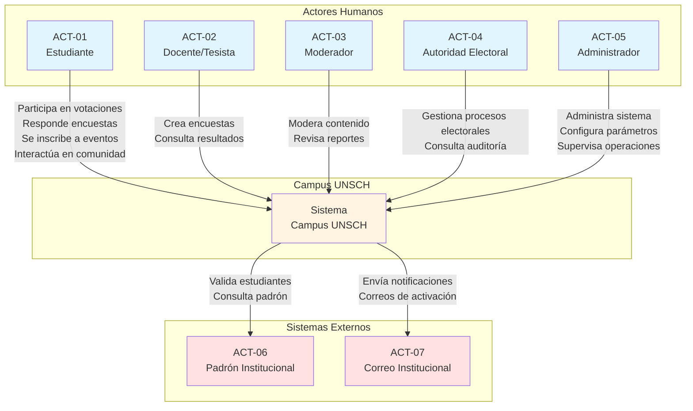

# Actores del Sistema Campus UNSCH

## Introducción

Los actores representan entidades que interactúan con el sistema Campus UNSCH. Se clasifican en actores humanos y sistemas externos. Este documento identifica y caracteriza cada actor según su rol, responsabilidades e interacciones con la plataforma.

---

## A. Actores Humanos

### ACT-01: Estudiante

**Tipo:** Actor Humano  
**Descripción:** Usuario principal del sistema. Estudiante habilitado de la UNSCH que accede a la plataforma para participar en votaciones, responder encuestas, inscribirse a eventos, interactuar en la comunidad y consultar sus incentivos.

**Responsabilidades:**
- Registrarse y autenticarse en la plataforma
- Mantener actualizada su información de perfil
- Emitir voto en procesos electorales habilitados
- Responder encuestas académicas y de investigación
- Inscribirse y asistir a eventos universitarios
- Participar en la comunidad estudiantil
- Consultar y canjear puntos acumulados
- Reportar contenido inapropiado

**Módulos con los que interactúa:**
- Identidad y Usuarios
- Votación Electoral
- Encuestas
- Eventos
- Comunidad
- Incentivos

---

### ACT-02: Docente/Tesista

**Tipo:** Actor Humano  
**Descripción:** Personal académico o estudiante de posgrado autorizado que utiliza la plataforma para crear y administrar encuestas dirigidas a la población estudiantil con fines académicos o de investigación.

**Responsabilidades:**
- Autenticarse en la plataforma con credenciales institucionales
- Crear encuestas académicas y de investigación
- Definir segmentos objetivo de estudiantes
- Configurar preguntas, validaciones y reglas de elegibilidad
- Consultar resultados y análisis de respuestas
- Exportar datos para investigación

**Módulos con los que interactúa:**
- Identidad y Usuarios
- Encuestas
- Reportes

---

### ACT-03: Moderador

**Tipo:** Actor Humano  
**Descripción:** Usuario con permisos especiales para supervisar y moderar el contenido de la comunidad estudiantil, garantizando el cumplimiento de las normas de convivencia institucional.

**Responsabilidades:**
- Revisar reportes de contenido inapropiado
- Ocultar o eliminar publicaciones que incumplan normas
- Aplicar medidas correctivas según políticas definidas
- Mantener trazabilidad de acciones de moderación
- Generar reportes de actividad de moderación

**Módulos con los que interactúa:**
- Identidad y Usuarios
- Comunidad
- Auditoría
- Administración

---

### ACT-04: Autoridad Electoral

**Tipo:** Actor Humano  
**Descripción:** Personal institucional autorizado para gestionar procesos electorales estudiantiles. Configura, supervisa y cierra procesos electorales garantizando transparencia y auditoría.

**Responsabilidades:**
- Crear y configurar procesos electorales
- Definir padrón habilitado, cargos y listas
- Establecer fecha y hora de inicio y cierre de votación
- Supervisar el desarrollo del proceso electoral
- Cerrar votación y habilitar resultados
- Consultar auditoría y trazabilidad electoral
- Generar reportes de participación

**Módulos con los que interactúa:**
- Identidad y Usuarios
- Votación Electoral
- Auditoría
- Reportes

---

### ACT-05: Administrador

**Tipo:** Actor Humano  
**Descripción:** Usuario con máximos privilegios en el sistema. Responsable de la gestión general de la plataforma, usuarios, roles, configuraciones y supervisión de operaciones críticas.

**Responsabilidades:**
- Gestionar usuarios y asignación de roles
- Configurar parámetros del sistema
- Supervisar encuestas, eventos y procesos
- Administrar reglas de incentivos y catálogo de recompensas
- Configurar límites y políticas del sistema
- Consultar trazabilidad y auditoría completa
- Acceder a panel administrativo y dashboards
- Gestionar respaldos y mantenimiento del sistema

**Módulos con los que interactúa:**
- Identidad y Usuarios
- Votación Electoral
- Encuestas
- Eventos
- Comunidad
- Incentivos
- Auditoría
- Administración
- Reportes

---

## B. Sistemas Externos

### ACT-06: Padrón Institucional UNSCH

**Tipo:** Sistema Externo  
**Descripción:** Sistema o servicio institucional que proporciona información oficial sobre estudiantes habilitados. Permite validar el DNI, condición de estudiante activo y datos institucionales durante el registro.

**Responsabilidades:**
- Proveer información de validación de estudiantes
- Confirmar condición de estudiante habilitado
- Proporcionar datos institucionales básicos (código, facultad, escuela)
- Mantener actualizado el padrón oficial

**Integración con Campus UNSCH:**
- Validación durante el proceso de registro
- Verificación de elegibilidad para procesos electorales
- Consulta de condición de estudiante para encuestas y eventos

**Módulos que lo consumen:**
- Identidad y Usuarios
- Votación Electoral

---

### ACT-07: Servicio de Correo Institucional UNSCH

**Tipo:** Sistema Externo  
**Descripción:** Servidor de correo electrónico institucional utilizado para enviar notificaciones, activaciones de cuenta, recordatorios y comunicaciones oficiales del sistema hacia los usuarios.

**Responsabilidades:**
- Enviar correos de activación de cuenta
- Enviar notificaciones de procesos electorales
- Enviar recordatorios de eventos
- Enviar alertas administrativas

**Integración con Campus UNSCH:**
- Notificaciones asíncronas mediante cola de mensajes
- Confirmación de envío y logs de correo
- Manejo de errores de entrega

**Módulos que lo consumen:**
- Identidad y Usuarios
- Notificaciones
- Votación Electoral
- Eventos

---

## Resumen de Actores

| ID | Nombre | Tipo | Rol Principal |
|----|--------|------|---------------|
| ACT-01 | Estudiante | Humano | Usuario principal del sistema |
| ACT-02 | Docente/Tesista | Humano | Creador de encuestas |
| ACT-03 | Moderador | Humano | Supervisor de comunidad |
| ACT-04 | Autoridad Electoral | Humano | Gestor de procesos electorales |
| ACT-05 | Administrador | Humano | Administrador del sistema |
| ACT-06 | Padrón Institucional | Sistema | Validación de estudiantes |
| ACT-07 | Correo Institucional | Sistema | Envío de notificaciones |

---

## Interacciones entre Actores

### Flujo de Validación Institucional
1. **Estudiante** (ACT-01) se registra en Campus UNSCH
2. El sistema consulta **Padrón Institucional** (ACT-06) para validar identidad y condición
3. El sistema envía correo de activación mediante **Correo Institucional** (ACT-07)
4. **Estudiante** activa su cuenta y accede a la plataforma

### Flujo de Proceso Electoral
1. **Autoridad Electoral** (ACT-04) crea y configura proceso electoral
2. El sistema verifica padrón habilitado con **Padrón Institucional** (ACT-06)
3. **Estudiante** (ACT-01) emite voto durante periodo habilitado
4. **Autoridad Electoral** cierra proceso y habilita resultados
5. **Administrador** (ACT-05) supervisa auditoría del proceso

### Flujo de Encuestas
1. **Docente/Tesista** (ACT-02) crea encuesta académica
2. **Estudiante** (ACT-01) responde encuesta y obtiene incentivos
3. **Administrador** (ACT-05) supervisa configuración de incentivos
4. **Docente/Tesista** consulta resultados agregados

### Flujo de Moderación Comunitaria
1. **Estudiante** (ACT-01) publica contenido en comunidad
2. Otros **Estudiantes** reportan contenido inapropiado
3. **Moderador** (ACT-03) revisa reporte y aplica medidas
4. **Administrador** (ACT-05) supervisa acciones de moderación y trazabilidad

### Flujo de Notificaciones
1. El sistema genera evento que requiere notificación
2. Se encola mensaje en sistema de mensajería
3. **Correo Institucional** (ACT-07) envía notificación asíncrona
4. **Estudiante** (ACT-01) recibe notificación en su correo institucional

---

## Diagrama de Actores y Contexto del Sistema

El siguiente diagrama muestra las interacciones generales entre los actores y Campus UNSCH:

**Descripción del diagrama:**
- Los actores humanos (azul claro) interactúan directamente con Campus UNSCH
- El sistema (amarillo claro) actúa como núcleo central de todas las operaciones
- Los sistemas externos (rojo claro) proveen servicios de validación y notificación
- Las flechas indican las principales interacciones entre actores y sistema
