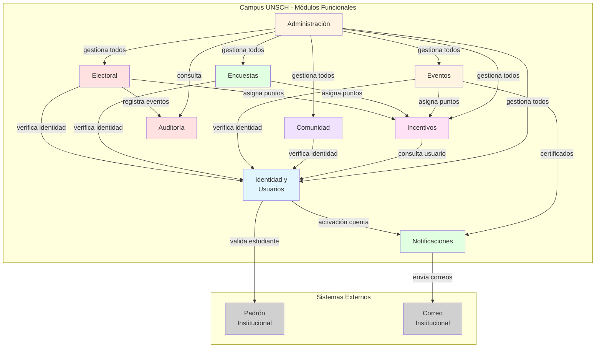
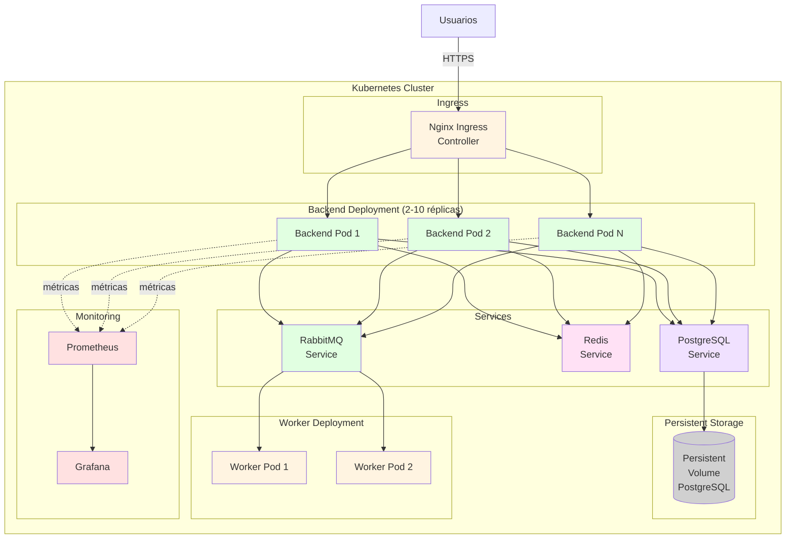

# Arquitectura Inicial - Campus UNSCH

## 1. Introducción

Este documento describe la arquitectura inicial propuesta para Campus UNSCH, derivada del análisis de requisitos funcionales, atributos de calidad, restricciones y drivers arquitectónicos.

**Decisión arquitectónica principal:** MONOLITO MODULAR ESCALABLE

---

## 2. Justificación del Estilo Arquitectónico

### 2.1. Decisión: Monolito Modular (no Microservicios)

**Razones para NO comenzar con microservicios:**

1. **Complejidad prematura:** Microservicios introducen complejidad operacional (orquestación, comunicación entre servicios, consistencia distribuida) que NO está justificada en la etapa inicial del proyecto
2. **Equipo y contexto:** Proyecto académico con recursos limitados; microservicios requieren madurez operacional significativa
3. **Límites de dominio aún en evolución:** Los límites entre módulos pueden ajustarse durante desarrollo inicial
4. **Overhead de comunicación:** La latencia de red entre microservicios afecta rendimiento en operaciones que cruzan dominios
5. **Transacciones distribuidas:** Garantizar consistencia (voto único, control de aforo) es más complejo en arquitectura distribuida

**Razones para adoptar Monolito MODULAR:**

1. **Separación lógica clara:** Límites bien definidos entre dominios facilitan mantenimiento
2. **Escalamiento horizontal posible:** Un monolito stateless puede escalar horizontalmente
3. **Menor complejidad operacional:** Un solo proceso a desplegar, monitorear y depurar
4. **Transacciones ACID nativas:** PostgreSQL garantiza consistencia sin coordinación distribuida
5. **Evolución futura:** Límites modulares permiten extracción posterior a microservicios si es necesario

---

## 3. Módulos del Monolito Modular

Campus UNSCH se organiza en los siguientes módulos funcionales con límites claros:

### Módulo 1: Identidad y Usuarios
**Responsabilidad:** Registro, autenticación, gestión de perfiles, roles y permisos  
**Dependencias:** Padrón Institucional (ACT-06), Correo Institucional (ACT-07)  
**Expone:** APIs de autenticación, gestión de usuarios, validación de roles

### Módulo 2: Electoral
**Responsabilidad:** Creación, gestión y ejecución de procesos electorales, emisión de votos, resultados  
**Dependencias:** Módulo de Identidad (verificación de estudiante), Módulo de Auditoría  
**Expone:** APIs de procesos electorales, emisión de voto, consulta de resultados  
**Criticidad:** ALTA - Candidato principal para extracción futura como microservicio

### Módulo 3: Encuestas
**Responsabilidad:** Creación, publicación y respuesta de encuestas académicas  
**Dependencias:** Módulo de Identidad, Módulo de Incentivos  
**Expone:** APIs de gestión de encuestas, respuesta, resultados agregados

### Módulo 4: Eventos
**Responsabilidad:** Publicación, inscripción, control de aforo, asistencia y certificados  
**Dependencias:** Módulo de Identidad, Módulo de Incentivos  
**Expone:** APIs de eventos, inscripción, validación QR, generación de certificados

### Módulo 5: Comunidad
**Responsabilidad:** Publicaciones, comentarios, moderación y reportes  
**Dependencias:** Módulo de Identidad  
**Expone:** APIs de publicaciones, comentarios, reportes, moderación

### Módulo 6: Incentivos
**Responsabilidad:** Asignación, consulta y canje de puntos  
**Dependencias:** Múltiples módulos (eventos, encuestas, electoral)  
**Expone:** APIs de puntos, catálogo de recompensas, canje

### Módulo 7: Notificaciones
**Responsabilidad:** Envío asíncrono de notificaciones por correo y WebSocket  
**Dependencias:** Correo Institucional (ACT-07), RabbitMQ  
**Expone:** APIs de encolado de notificaciones

### Módulo 8: Auditoría
**Responsabilidad:** Registro inmutable de eventos críticos del sistema  
**Dependencias:** Todos los módulos generan eventos de auditoría  
**Expone:** APIs de consulta de auditoría (solo administradores/autoridades)

### Módulo 9: Administración
**Responsabilidad:** Panel administrativo, gestión de configuración, respaldos  
**Dependencias:** Todos los módulos  
**Expone:** APIs administrativas, dashboards

---

## 4. Arquitectura Lógica

### 4.1. Capas de la Arquitectura

```
┌─────────────────────────────────────────────────────────┐
│                  CAPA DE PRESENTACIÓN                   │
│         (React/Next.js - Aplicación Web Responsive)     │
└─────────────────────────────────────────────────────────┘
                           ↓ HTTPS
┌─────────────────────────────────────────────────────────┐
│              BALANCEADOR DE CARGA (Nginx)               │
└─────────────────────────────────────────────────────────┘
                           ↓
        ┌──────────────────┼──────────────────┐
        ↓                  ↓                  ↓
┌───────────────┐  ┌───────────────┐  ┌───────────────┐
│   Backend     │  │   Backend     │  │   Backend     │
│  Instancia 1  │  │  Instancia 2  │  │  Instancia N  │
│ (Node.js/     │  │ (Node.js/     │  │ (Node.js/     │
│  NestJS)      │  │  NestJS)      │  │  NestJS)      │
└───────────────┘  └───────────────┘  └───────────────┘
        │                  │                  │
        └──────────────────┴──────────────────┘
                           ↓
┌─────────────────────────────────────────────────────────┐
│                   CAPA DE SERVICIOS                     │
│   ┌────────────┐ ┌──────────┐ ┌────────────┐ ...      │
│   │ Identidad  │ │Electoral │ │  Encuestas │          │
│   └────────────┘ └──────────┘ └────────────┘          │
└─────────────────────────────────────────────────────────┘
                           ↓
        ┌──────────────────┼──────────────────┐
        ↓                  ↓                  ↓
┌───────────────┐  ┌───────────────┐  ┌───────────────┐
│  PostgreSQL   │  │     Redis     │  │   RabbitMQ    │
│    (BD Main)  │  │  (Caché/      │  │  (Cola de     │
│               │  │   Sesiones)   │  │  Mensajes)    │
└───────────────┘  └───────────────┘  └───────────────┘
```

### 4.2. Flujo de Comunicación

1. **Cliente → Balanceador:** Usuario accede vía HTTPS
2. **Balanceador → Backend:** Distribución round-robin entre instancias
3. **Backend → Redis:** Validación de sesión, caché de consultas frecuentes
4. **Backend → PostgreSQL:** Operaciones transaccionales (CRUD, transacciones ACID)
5. **Backend → RabbitMQ:** Encolado de tareas asíncronas (notificaciones, certificados)
6. **RabbitMQ → Worker (Backend):** Procesamiento asíncrono de tareas

---

## 5. Características Arquitectónicas Clave

### 5.1. Backend Stateless

- **Sesiones en Redis:** No se almacena estado en memoria del proceso backend
- **JWT o tokens en Redis:** Validación distribuida de autenticación
- **Permite escalamiento horizontal:** Cualquier instancia puede atender cualquier solicitud

### 5.2. Transacciones y Consistencia

- **PostgreSQL con ACID:** Garantía de consistencia en operaciones críticas
- **Nivel de aislamiento:** READ COMMITTED o REPEATABLE READ según operación
- **Restricciones de unicidad:** (estudiante + proceso) para votos, (estudiante + evento) para inscripciones
- **Operaciones idempotentes:** Claves de idempotencia para asignación de puntos

### 5.3. Caché Distribuido (Redis)

**Casos de uso:**
- Sesiones de usuario
- Rate limiting (protección contra fuerza bruta)
- Consultas frecuentes (listado de eventos, padrón habilitado)
- Locks distribuidos (control de concurrencia)

**Estrategia:**
- TTL (Time To Live) configurado por tipo de dato
- Invalidación explícita cuando datos cambian
- Fallback a base de datos si caché no disponible

### 5.4. Procesamiento Asíncrono (RabbitMQ)

**Casos de uso:**
- Envío de correos electrónicos
- Generación de certificados PDF
- Procesamiento de reportes pesados
- Asignación diferida de incentivos

**Beneficio:**
- Respuesta inmediata al usuario
- Procesamiento en background sin bloquear APIs
- Reintentos automáticos en caso de fallo

### 5.5. Comunicación en Tiempo Real (WebSockets)

**Casos de uso:**
- Notificaciones push (nuevo evento, cierre de votación)
- Actualizaciones de estado en dashboards administrativos
- Alertas de moderación

**Implementación:**
- Socket.IO o WebSocket nativo
- Conexión persistente por usuario autenticado
- Fallback a polling si WebSocket no soportado

---

## 6. Arquitectura de Despliegue y Escalabilidad

### 6.1. Componentes de Infraestructura

```
                    ┌─────────────────┐
                    │   INTERNET      │
                    └────────┬────────┘
                             │
                    ┌────────▼────────┐
                    │  Load Balancer  │
                    │  (Nginx/Ingress)│
                    └────────┬────────┘
                             │
          ┌──────────────────┼──────────────────┐
          │                  │                  │
    ┌─────▼─────┐      ┌─────▼─────┐    ┌─────▼─────┐
    │Backend Pod│      │Backend Pod│    │Backend Pod│
    │ (NestJS)  │      │ (NestJS)  │    │ (NestJS)  │
    └─────┬─────┘      └─────┬─────┘    └─────┬─────┘
          │                  │                  │
          └──────────────────┴──────────────────┘
                             │
          ┌──────────────────┼──────────────────┐
          │                  │                  │
    ┌─────▼─────┐      ┌─────▼─────┐    ┌─────▼─────┐
    │PostgreSQL │      │   Redis   │    │ RabbitMQ  │
    │Service    │      │  Service  │    │  Service  │
    └───────────┘      └───────────┘    └───────────┘
          │                                    │
    ┌─────▼─────┐                      ┌─────▼─────┐
    │Persistent │                      │ Worker    │
    │  Volume   │                      │  Pods     │
    └───────────┘                      └───────────┘
```

### 6.2. Escalamiento Horizontal

**Configuración de HPA (Horizontal Pod Autoscaler):**
```yaml
minReplicas: 2
maxReplicas: 10
targetCPUUtilizationPercentage: 70
targetMemoryUtilizationPercentage: 80
```

**Comportamiento:**
- **Carga baja:** 2 réplicas (mínimo para alta disponibilidad)
- **Carga media:** 3-5 réplicas (operación normal)
- **Carga alta:** 6-10 réplicas (procesos electorales, eventos masivos)
- **Pre-escalado:** Incremento manual antes de eventos programados

### 6.3. Dimensionamiento por Componente

| Componente | CPU (por instancia) | RAM (por instancia) | Réplicas Min/Max |
|------------|---------------------|---------------------|------------------|
| Backend    | 2-4 vCPU           | 4-8 GB              | 2 / 10           |
| PostgreSQL | 4-8 vCPU           | 8-16 GB             | 1 (con réplica opcional) |
| Redis      | 1-2 vCPU           | 2-4 GB              | 1 (con réplica opcional) |
| RabbitMQ   | 1-2 vCPU           | 2-4 GB              | 1                |

---

## 7. Consideraciones Especiales: Módulo Electoral

### 7.1. ¿Por qué el Módulo Electoral es Crítico?

- **Consistencia absoluta:** Voto único, sin duplicados
- **Privacidad:** Separación de participación y voto
- **Auditoría:** Trazabilidad completa sin revelar votos individuales
- **Alta concurrencia:** Pico máximo de uso durante votaciones
- **Confianza institucional:** Errores comprometen legitimidad

### 7.2. Diseño del Módulo Electoral

**Tablas principales:**
```
procesos_electorales (id, nombre, fecha_inicio, fecha_cierre, estado)
padron_electoral (proceso_id, estudiante_id)
listas_electorales (id, proceso_id, nombre)
votos (id, proceso_id, lista_id, timestamp) ← SIN estudiante_id
participacion (id, proceso_id, estudiante_id, timestamp) ← SIN lista_id
```

**Separación clave:**
- **Tabla `votos`:** Registra qué lista recibió voto, sin identificar al estudiante
- **Tabla `participacion`:** Registra que el estudiante votó, sin revelar por quién
- **Imposibilidad de correlación:** No existe join directo entre ambas tablas

**Garantía de voto único:**
```sql
ALTER TABLE participacion
ADD CONSTRAINT uq_participacion
UNIQUE (proceso_id, estudiante_id);
```

### 7.3. ¿Cuándo Extraer Electoral como Microservicio?

**Condiciones que justificarían extracción:**
1. **Requisitos regulatorios estrictos:** Auditoría externa exige aislamiento
2. **Escalamiento independiente crítico:** Necesidad de escalar solo Electoral sin otros módulos
3. **Equipo dedicado:** Personal especializado en seguridad electoral
4. **Tecnología específica:** Necesidad de lenguaje/BD distinto para Electoral
5. **Complejidad creciente:** Módulo Electoral supera 30-40% del código total

**Preparación actual:**
- Límites claros del módulo Electoral
- APIs bien definidas
- Base de datos lógicamente separable (esquema `electoral`)
- Mínima dependencia de otros módulos

---

## 8. Observabilidad y Monitoreo

### 8.1. Métricas de Prometheus

**Métricas de aplicación:**
- `http_requests_total{method, endpoint, status}`
- `http_request_duration_seconds{endpoint, quantile}`
- `db_query_duration_seconds{operation}`
- `cache_hit_ratio`
- `active_sessions_total`
- `votes_cast_total{proceso_id}`

**Métricas de sistema:**
- CPU, memoria, disco por pod
- Conexiones activas a PostgreSQL
- Tamaño de colas RabbitMQ

### 8.2. Dashboards de Grafana

1. **Dashboard de Rendimiento:** Latencia, throughput, tasa de errores
2. **Dashboard de Infraestructura:** CPU, memoria, réplicas activas
3. **Dashboard Electoral:** Votos por hora, participación en tiempo real
4. **Dashboard de Usuarios:** Usuarios activos, sesiones concurrentes

### 8.3. Alertas

- Tasa de errores > 5% durante 5 minutos
- Latencia p95 > 3 segundos
- CPU > 85% durante 5 minutos
- Conexiones a BD > 80% del pool
- Disco de PostgreSQL > 85%

---

## 9. Riesgos Arquitectónicos y Mitigaciones

| Riesgo | Probabilidad | Impacto | Mitigación |
|--------|--------------|---------|------------|
| Fallo de BD principal | Media | Crítico | Respaldos automáticos cada 6 horas; réplica de lectura opcional |
| Saturación de conexiones a BD | Media | Alto | Pool de conexiones optimizado; monitoreo de uso |
| Inconsistencia en votos por concurrencia extrema | Baja | Crítico | Restricciones de unicidad; transacciones ACID; pruebas de carga exhaustivas |
| Escalado insuficiente ante pico inesperado | Media | Alto | Pre-escalado antes de eventos; HPA configurado; alertas tempranas |
| Compromiso de privacidad del voto | Baja | Crítico | Separación arquitectónica de votos y participación; auditoría de código |

---

## 10. Evolución Arquitectónica Futura

### Fase 1: Monolito Modular (Actual)
- ✓ Simplicidad operacional
- ✓ Transacciones ACID nativas
- ✓ Escalamiento horizontal
- Límite: ~10,000 - 15,000 usuarios concurrentes

### Fase 2: Extracción de Electoral (Si se justifica)
- Microservicio Electoral independiente
- Mayor aislamiento y seguridad
- Escalamiento independiente
- Complejidad operacional aumenta

### Fase 3: Arquitectura Híbrida (Largo plazo)
- Módulos críticos como microservicios
- Módulos menos críticos en monolito
- Service mesh para comunicación
- Requiere madurez organizacional

---

## 11. Decisiones Arquitectónicas Clave

### DA-ARCH-01: Monolito Modular Stateless
**Decisión:** Iniciar con monolito modular escalable horizontalmente  
**Alternativas consideradas:** Microservicios desde el inicio  
**Razón:** Menor complejidad, transacciones ACID, límites claros para evolución futura

### DA-ARCH-02: Backend Node.js + NestJS
**Decisión:** Utilizar Node.js con NestJS como framework backend  
**Alternativas consideradas:** Java Spring Boot, Python Django/FastAPI  
**Razón:** TypeScript end-to-end, arquitectura modular nativa en NestJS, ecosistema maduro

### DA-ARCH-03: PostgreSQL como BD principal
**Decisión:** PostgreSQL para almacenamiento transaccional  
**Alternativas consideradas:** MySQL, MongoDB  
**Razón:** ACID robusto, transacciones complejas, integridad referencial, rendimiento adecuado

### DA-ARCH-04: Redis para caché y sesiones
**Decisión:** Redis como caché distribuido y almacenamiento de sesiones  
**Alternativas consideradas:** Memcached, caché en memoria del proceso  
**Razón:** Persistencia opcional, estructuras de datos ricas, locks distribuidos

### DA-ARCH-05: Separación arquitectónica de voto y participación
**Decisión:** Tablas independientes sin relación directa entre voto y estudiante  
**Alternativas consideradas:** Cifrado de votos con clave única del estudiante  
**Razón:** Imposibilidad arquitectónica de correlación es más robusta que cifrado

---

## 12. Conclusión

La arquitectura inicial de Campus UNSCH como **monolito modular escalable** balancea adecuadamente:
- **Simplicidad:** Operación y desarrollo menos complejos
- **Rendimiento:** Capacidad de manejar escenario objetivo de 15,000 usuarios concurrentes
- **Consistencia:** Transacciones ACID garantizan voto único y control de aforo
- **Seguridad:** Separación arquitectónica protege privacidad del voto
- **Evolución:** Límites claros permiten extracción futura de módulos críticos

Esta decisión responde directamente a los drivers arquitectónicos identificados y establece una base sólida para el desarrollo del sistema.

---

## 13. Diagramas Arquitectónicos

### 13.1. Diagrama de Módulos Funcionales



**Descripción:**  
Este diagrama muestra los 9 módulos funcionales de Campus UNSCH y sus dependencias principales. El módulo de Identidad es central pues todos los demás módulos dependen de él para verificación de usuarios. El módulo Electoral (rojo claro) es el candidato principal para extracción futura como microservicio debido a su criticidad.

---

### 13.2. Diagrama de Arquitectura Lógica

```mermaid
graph TB
    subgraph "Capa de Presentación"
        WEB[Aplicación Web<br/>React/Next.js<br/>Responsive]
    end
    
    subgraph "Balanceo y Enrutamiento"
        LB[Load Balancer<br/>Nginx/Ingress]
    end
    
    subgraph "Capa de Aplicación - Múltiples Instancias"
        BE1[Backend Instance 1<br/>Node.js/NestJS]
        BE2[Backend Instance 2<br/>Node.js/NestJS]
        BEN[Backend Instance N<br/>Node.js/NestJS]
    end
    
    subgraph "Capa de Servicios (Módulos)"
        MOD[Identidad | Electoral | Encuestas<br/>Eventos | Comunidad | Incentivos<br/>Notificaciones | Auditoría | Admin]
    end
    
    subgraph "Capa de Datos"
        PG[(PostgreSQL<br/>BD Transaccional)]
        RD[(Redis<br/>Caché/Sesiones)]
        MQ[RabbitMQ<br/>Cola Mensajes]
    end
    
    subgraph "Procesamiento Asíncrono"
        WORK[Workers<br/>Correos, Certificados]
    end
    
    WEB -->|HTTPS| LB
    LB --> BE1
    LB --> BE2
    LB --> BEN
    BE1 --> MOD
    BE2 --> MOD
    BEN --> MOD
    MOD --> PG
    MOD --> RD
    MOD --> MQ
    MQ --> WORK
    WORK --> PG
    
    style WEB fill:#e1f5ff
    style LB fill:#fff4e1
    style BE1 fill:#e1ffe1
    style BE2 fill:#e1ffe1
    style BEN fill:#e1ffe1
    style MOD fill:#ffe1e1
    style PG fill:#f0e1ff
    style RD fill:#ffe1f5
    style MQ fill:#e1ffe1
    style WORK fill:#fff4e1
```

**Descripción:**  
Este diagrama ilustra las capas lógicas de la arquitectura. El frontend web se comunica mediante HTTPS con el balanceador de carga, que distribuye las solicitudes entre múltiples instancias del backend. Cada instancia del backend contiene todos los módulos funcionales (monolito modular) y accede a PostgreSQL para operaciones transaccionales, Redis para caché/sesiones, y RabbitMQ para tareas asíncronas procesadas por workers.

---

### 13.3. Diagrama de Despliegue Escalable (Kubernetes)



**Descripción:**  
Este diagrama muestra el despliegue en Kubernetes. Los usuarios acceden a través del Ingress Controller, que enruta hacia múltiples pods del backend (escalables horizontalmente mediante HPA). Los pods acceden a PostgreSQL, Redis y RabbitMQ a través de Services. Prometheus recolecta métricas de todos los pods y Grafana las visualiza. El almacenamiento persistente de PostgreSQL está respaldado por Persistent Volumes.