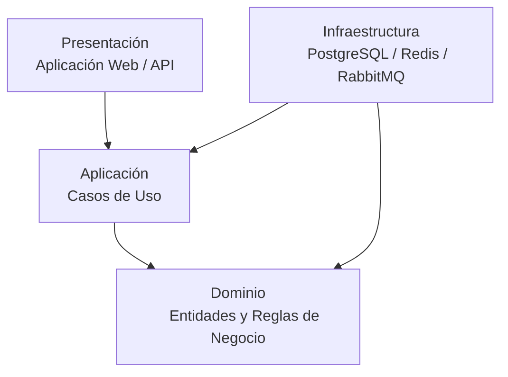

# Enfoque Arquitectónico - Campus UNSCH

## 1. Enfoque seleccionado

Para la organización interna de Campus UNSCH se adopta **Clean Architecture**.

Este enfoque busca separar las reglas del negocio de los detalles tecnológicos, permitiendo que la lógica principal del sistema no dependa directamente de frameworks, bases de datos, interfaces de usuario o servicios externos.

Clean Architecture complementa el estilo arquitectónico definido para el proyecto: **Monolito Modular Escalable**.

El monolito modular define cómo se organiza globalmente y se despliega el sistema, mientras que Clean Architecture establece cómo se organizan internamente las responsabilidades y dependencias.

---

## 2. Objetivo

El objetivo principal es mantener las reglas del negocio de Campus UNSCH independientes de los detalles tecnológicos.

Esto permite:

- separar responsabilidades;
- reducir el acoplamiento;
- facilitar el mantenimiento;
- mejorar las pruebas;
- permitir cambios tecnológicos con menor impacto en el dominio.

---

## 3. Problema que resuelve

Campus UNSCH integra funcionalidades con diferentes niveles de criticidad, como:

- autenticación de estudiantes;
- procesos electorales;
- encuestas;
- eventos;
- comunidad estudiantil;
- incentivos;
- notificaciones;
- auditoría.

Sin una separación adecuada, las reglas de negocio podrían quedar fuertemente acopladas a tecnologías como PostgreSQL, Redis, RabbitMQ o al framework utilizado en el backend.

Clean Architecture permite mantener estas dependencias controladas.

---

## 4. Capas de Clean Architecture

| Capa | Responsabilidad en Campus UNSCH |
|---|---|
| Presentación | Recibe las acciones de los usuarios y presenta los resultados mediante la aplicación web y la API. |
| Aplicación | Coordina los casos de uso del sistema y el flujo de las operaciones. |
| Dominio | Contiene las entidades y reglas principales del negocio. |
| Infraestructura | Implementa acceso a datos, caché, mensajería y comunicación con servicios externos. |

---

## 5. Capa de Presentación

La capa de Presentación representa el punto de interacción entre los usuarios y el sistema.

Incluye principalmente:

- aplicación web;
- controladores de la API;
- validación inicial de solicitudes;
- presentación de respuestas al usuario.

Los actores que interactúan con esta capa incluyen estudiantes, administradores, autoridades electorales y otros usuarios autorizados.

Esta capa no debe contener las reglas principales del negocio.

---

## 6. Capa de Aplicación

La capa de Aplicación coordina los casos de uso del sistema.

Algunos ejemplos son:

- autenticar estudiante;
- emitir voto;
- responder encuesta;
- inscribirse a un evento;
- publicar contenido;
- asignar incentivos.

Esta capa recibe solicitudes desde Presentación, ejecuta el flujo correspondiente y utiliza las reglas definidas en el Dominio.

También define interfaces para operaciones que posteriormente serán implementadas por la infraestructura.

---

## 7. Capa de Dominio

La capa de Dominio contiene las reglas principales del negocio y representa el núcleo de la aplicación.

Algunos elementos del dominio son:

- Usuario;
- Estudiante;
- Proceso Electoral;
- Voto;
- Encuesta;
- Evento;
- Inscripción;
- Incentivo.

Ejemplos de reglas de negocio:

- un estudiante solo puede emitir un voto por proceso electoral;
- una inscripción no puede superar el aforo disponible;
- los incentivos no deben asignarse de manera duplicada;
- solo usuarios autorizados pueden realizar determinadas operaciones.

El Dominio no debe depender directamente de PostgreSQL, Redis, RabbitMQ ni de frameworks externos.

---

## 8. Capa de Infraestructura

La capa de Infraestructura contiene las implementaciones técnicas necesarias para que el sistema funcione.

En Campus UNSCH incluye:

- PostgreSQL para persistencia de datos;
- Redis para caché y operaciones distribuidas;
- RabbitMQ para procesamiento asíncrono;
- implementaciones concretas de repositorios;
- integración con servicios institucionales.

La infraestructura puede cambiar sin modificar innecesariamente las reglas principales del Dominio.

---

## 9. Ejemplos aplicados

### 9.1. Emisión de voto

Un estudiante solicita emitir un voto desde la aplicación web.

El flujo sería:

1. Presentación recibe la solicitud.
2. Aplicación ejecuta el caso de uso de emisión de voto.
3. Dominio valida las reglas del proceso electoral.
4. Infraestructura persiste el voto en PostgreSQL.
5. El resultado vuelve hacia la capa de Presentación.

La regla de voto único pertenece al Dominio y no a la base de datos o a la interfaz web.

### 9.2. Inscripción a eventos

Cuando un estudiante intenta inscribirse a un evento:

1. Presentación recibe la solicitud.
2. Aplicación ejecuta el caso de uso.
3. Dominio verifica las reglas de inscripción y aforo.
4. Infraestructura registra la inscripción.
5. Presentación informa el resultado.

### 9.3. Encuestas

Para responder una encuesta:

1. Presentación recibe las respuestas.
2. Aplicación coordina el registro.
3. Dominio valida las reglas de participación.
4. Infraestructura almacena la información.
5. Presentación confirma la operación.

---

## 10. Regla de dependencias

La regla principal de Clean Architecture establece que las dependencias deben orientarse hacia las capas internas.

Por lo tanto:

- Presentación puede depender de Aplicación.
- Aplicación puede depender de Dominio.
- Dominio no depende de Presentación ni de Infraestructura.
- Infraestructura implementa interfaces requeridas por las capas internas.

De esta forma, las reglas del negocio permanecen protegidas frente a cambios tecnológicos.

---

## 11. Diagrama

La dirección de las dependencias busca mantener al Dominio como la parte más independiente del sistema.

---

## 12. Relación con el Monolito Modular

Clean Architecture no reemplaza al estilo Monolito Modular Escalable.

Ambos conceptos trabajan en niveles diferentes.

El **Monolito Modular Escalable** organiza Campus UNSCH en módulos funcionales como:

- Identidad y Usuarios;
- Electoral;
- Encuestas;
- Eventos;
- Comunidad;
- Incentivos;
- Notificaciones;
- Auditoría;
- Administración.

Dentro de estos módulos, Clean Architecture permite separar las responsabilidades entre Presentación, Aplicación, Dominio e Infraestructura.

Por lo tanto, el sistema puede mantenerse como una sola aplicación desplegable y al mismo tiempo conservar una organización interna desacoplada.

---

## 13. Beneficios

La aplicación de Clean Architecture en Campus UNSCH proporciona los siguientes beneficios:

- **Mantenibilidad:** los cambios pueden localizarse en capas específicas.
- **Bajo acoplamiento:** las reglas del negocio no dependen directamente de tecnologías externas.
- **Pruebas:** el Dominio y los casos de uso pueden probarse independientemente de la infraestructura.
- **Separación de responsabilidades:** cada capa cumple una función específica.
- **Evolución tecnológica:** PostgreSQL, Redis, RabbitMQ u otros componentes pueden evolucionar con menor impacto sobre el núcleo del sistema.
- **Evolución arquitectónica:** facilita mantener límites claros entre módulos y permite futuras modificaciones si las necesidades del proyecto cambian.

---

## 14. Conclusión

Campus UNSCH utiliza **Clean Architecture** como enfoque para organizar las responsabilidades internas y controlar las dependencias del sistema.

Este enfoque complementa al **Monolito Modular Escalable**, manteniendo las reglas del negocio separadas de los detalles tecnológicos y facilitando la mantenibilidad, las pruebas y la evolución futura de la plataforma.
