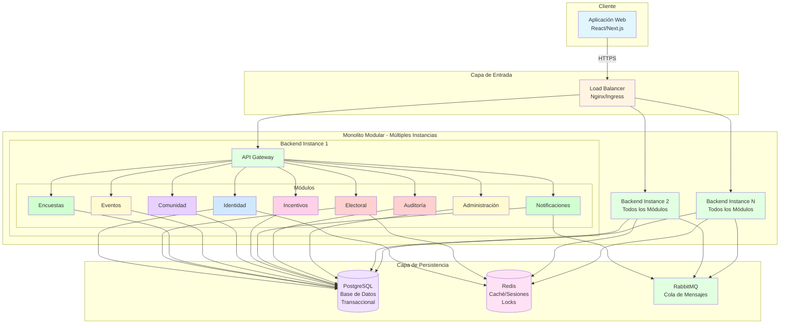

# Estilo Arquitectónico - Campus UNSCH

## 1. Estilo Seleccionado

**Monolito Modular Escalable**

Este estilo arquitectónico combina las ventajas de una arquitectura monolítica (simplicidad operacional, transacciones nativas) con las características de modularidad necesarias para un sistema que debe escalar, evolucionar y mantener límites claros entre dominios funcionales.

---

## 2. Descripción del Estilo

Un **monolito modular** es una aplicación desplegada como una única unidad (single deployment unit) pero organizada internamente en módulos cohesivos con límites bien definidos. Cada módulo:

- Tiene una **responsabilidad clara** dentro de un dominio funcional específico
- Expone **interfaces bien definidas** (APIs internas) para otros módulos
- Mantiene **bajo acoplamiento** con otros módulos
- Puede ser **desarrollado y probado** de forma relativamente independiente
- Puede ser **extraído como microservicio** en el futuro si se justifica

La característica **escalable** indica que el monolito está diseñado para escalar horizontalmente: múltiples instancias idénticas pueden desplegarse sin estado compartido en memoria (stateless), distribuyendo la carga mediante un balanceador.

---

## 3. Justificación del Estilo Seleccionado

### 3.1. Modularidad

**Ventaja:** Los 9 módulos funcionales de Campus UNSCH tienen límites claros que facilitan:
- **Desarrollo paralelo:** Equipos distintos pueden trabajar en módulos diferentes
- **Mantenimiento localizado:** Cambios en un módulo tienen impacto limitado en otros
- **Comprensión del sistema:** La organización modular hace el código más navegable
- **Testing enfocado:** Cada módulo puede probarse de forma aislada

**Implementación:**
- Estructura de directorios que refleja módulos (`src/modules/identidad/`, `src/modules/electoral/`, etc.)
- Inyección de dependencias explícita entre módulos (NestJS facilita esto mediante decoradores)
- Comunicación entre módulos únicamente a través de interfaces públicas

### 3.2. Escalabilidad y Rendimiento

**Ventaja:** El diseño stateless permite escalado horizontal para manejar el escenario objetivo:
- **2,500 usuarios concurrentes** durante picos (procesos electorales, eventos masivos)
- **Throughput de 250 req/s** en operaciones críticas
- **Elasticidad:** Kubernetes HPA ajusta réplicas automáticamente (2-10 instancias)

**Implementación:**
- Sesiones almacenadas en Redis (compartidas entre todas las instancias)
- Sin estado en memoria del proceso backend
- Balanceo de carga round-robin entre réplicas
- Pre-escalado manual antes de eventos programados de alta carga

### 3.3. Consistencia

**Ventaja:** Transacciones ACID nativas de PostgreSQL garantizan consistencia en operaciones críticas:
- **Voto único:** Restricción `UNIQUE (estudiante_id, proceso_id)` previene duplicados
- **Control de aforo:** Restricciones de BD evitan sobrepaso de cupo en eventos
- **Integridad referencial:** Relaciones entre tablas garantizadas por la base de datos

**Implementación:**
- Uso de transacciones explícitas en operaciones críticas
- Restricciones de unicidad y checks en nivel de base de datos
- Nivel de aislamiento READ COMMITTED o REPEATABLE READ según operación
- Sin necesidad de coordinación distribuida (sagas, 2PC)

### 3.4. Mantenibilidad

**Ventaja:** Operación y desarrollo más simples que arquitecturas distribuidas:
- **Un solo proceso a desplegar:** Simplifica CI/CD y rollback
- **Un solo runtime a monitorear:** Logs, métricas y trazas en un único contexto
- **Debugging más directo:** Stack traces completos sin saltos entre servicios
- **Gestión de dependencias unificada:** Un solo `package.json` para el backend

**Comparación con microservicios:**
- Microservicios: N servicios × (despliegue + monitoreo + debugging + coordinación)
- Monolito modular: 1 servicio con límites claros internos

---

## 4. Módulos Principales

Campus UNSCH se organiza en **9 módulos funcionales**:

### 4.1. Identidad y Usuarios
Gestiona registro, autenticación (JWT), perfiles, roles y permisos. Integra con Padrón Institucional para validación.

### 4.2. Electoral
Procesos electorales, emisión de votos, resultados. **Módulo crítico** con separación arquitectónica de voto y participación para garantizar privacidad.

### 4.3. Encuestas
Creación, publicación y respuesta de encuestas académicas. Resultados agregados disponibles públicamente.

### 4.4. Eventos
Publicación de eventos, inscripción, control de aforo, registro de asistencia (QR), generación de certificados.

### 4.5. Comunidad
Publicaciones estudiantiles, comentarios, moderación y reportes de contenido inapropiado.

### 4.6. Incentivos
Sistema de puntos por participación, catálogo de recompensas, canje de puntos.

### 4.7. Notificaciones
Envío asíncrono de notificaciones por correo electrónico y WebSocket para notificaciones en tiempo real.

### 4.8. Auditoría
Registro inmutable de eventos críticos del sistema. Solo accesible para administradores y autoridades.

### 4.9. Administración
Panel administrativo, gestión de configuración, respaldos, reportes ejecutivos.

---

## 5. ¿Por Qué NO Microservicios Inicialmente?

La decisión de **no comenzar con microservicios** responde a:

### 5.1. Complejidad Operacional Prematura
- **Despliegue:** N servicios requieren N pipelines CI/CD, N configuraciones, N rollbacks independientes
- **Monitoreo:** Trazabilidad entre servicios (distributed tracing) añade complejidad
- **Debugging:** Errores que cruzan servicios son más difíciles de diagnosticar
- **Gestión de dependencias:** Cada servicio con su stack, versiones y dependencias

### 5.2. Contexto del Proyecto
- **Proyecto académico** con recursos limitados (equipo, tiempo, presupuesto)
- **Madurez operacional:** Microservicios requieren experiencia en orquestación, service mesh, observabilidad distribuida
- **Límites de dominio en evolución:** Los límites entre módulos pueden ajustarse durante desarrollo inicial

### 5.3. Overhead de Comunicación
- **Latencia de red:** Llamadas entre microservicios añaden latencia (típicamente 10-50ms por salto)
- **Serialización:** Overhead de serializar/deserializar datos en cada llamada HTTP/gRPC
- **Operaciones multi-dominio:** Flujos que cruzan 3-4 servicios acumulan latencia significativa

### 5.4. Consistencia Distribuida
- **Transacciones distribuidas:** Sagas, compensación, eventual consistency añaden complejidad
- **Voto único:** Garantizar que un estudiante vote solo una vez es más simple con transacciones ACID locales
- **Control de aforo:** Restricciones de BD son más robustas que coordinación entre servicios

---

## 6. Evolución Futura del Estilo

### 6.1. Preparación para Evolución

El monolito modular está diseñado para **facilitar extracción futura** de módulos como microservicios si se justifica:

- **Límites modulares claros:** Cada módulo tiene responsabilidades bien definidas
- **APIs internas documentadas:** Interfaces entre módulos sirven como contratos
- **Bajo acoplamiento:** Dependencias mínimas entre módulos
- **Separación de datos:** Posibilidad de dividir esquemas de BD por módulo

### 6.2. Candidato Principal: Módulo Electoral

El **módulo Electoral** es el candidato prioritario para extracción como microservicio si:

1. **Requisitos regulatorios:** Auditorías externas exigen aislamiento físico
2. **Escalado independiente crítico:** Necesidad de escalar solo Electoral sin otros módulos
3. **Equipo dedicado:** Personal especializado exclusivamente en seguridad electoral
4. **Complejidad creciente:** Electoral supera 30-40% del código total del sistema
5. **Tecnología específica:** Necesidad de lenguaje/runtime distinto para Electoral

**Preparación actual:**
- Límites claros con interfaces bien definidas
- Separación lógica de tablas (esquema `electoral` en PostgreSQL)
- Mínima dependencia de otros módulos (solo Identidad y Auditoría)
- Documentación arquitectónica completa

### 6.3. Fases de Evolución

#### Fase 1: Monolito Modular (Actual)
- ✓ Simplicidad operacional
- ✓ Transacciones ACID nativas
- ✓ Escalamiento horizontal (2-10 réplicas)
- **Límite:** Soporta 2,500 usuarios concurrentes

#### Fase 2: Extracción Selectiva (Si se justifica)
- Módulo Electoral como microservicio independiente
- Comunicación vía APIs REST o gRPC
- Base de datos dedicada para Electoral
- Escalado independiente de Electoral vs resto del sistema
- **Complejidad:** Aumenta operación y coordinación

#### Fase 3: Arquitectura Híbrida (Largo plazo)
- Módulos críticos/alta-escala como microservicios
- Módulos estables/baja-escala en monolito
- Service mesh (Istio/Linkerd) para comunicación
- **Requisito:** Madurez organizacional y justificación técnica clara

---

## 7. Diagrama Arquitectónico del Estilo

**Descripción del diagrama:**

1. **Cliente:** Aplicación web responsiva desarrollada en React/Next.js
2. **Load Balancer:** Distribuye tráfico HTTPS entre múltiples instancias del backend
3. **Monolito Modular:** Cada instancia contiene todos los 9 módulos funcionales
   - API Gateway enruta solicitudes al módulo correspondiente
   - Módulos están internamente separados pero desplegados juntos
   - Electoral destacado en rojo por su criticidad
4. **PostgreSQL:** Base de datos transaccional ACID para persistencia
5. **Redis:** Caché distribuido, sesiones de usuario, locks distribuidos
6. **RabbitMQ:** Cola de mensajes para procesamiento asíncrono

**Características clave visibles en el diagrama:**
- **Escalado horizontal:** Múltiples instancias idénticas del monolito
- **Estado compartido:** Redis y PostgreSQL accesibles desde todas las instancias
- **Todos los módulos en todas las instancias:** No hay división de responsabilidades por instancia
- **Balanceo de carga:** Cualquier instancia puede atender cualquier solicitud

---

## 8. Coherencia con Drivers Arquitectónicos

| Driver Arquitectónico | Cómo el Estilo lo Atiende |
|-----------------------|---------------------------|
| **DA-01:** Alta Concurrencia y Rendimiento | Escalado horizontal stateless (2-10 instancias), caché distribuido (Redis), procesamiento asíncrono (RabbitMQ) |
| **DA-02:** Consistencia en Operaciones Críticas | Transacciones ACID nativas de PostgreSQL, restricciones de unicidad en BD, sin coordinación distribuida |
| **DA-03:** Escalabilidad y Elasticidad | HPA de Kubernetes ajusta réplicas automáticamente según CPU/memoria, soporta crecimiento futuro mediante extracción selectiva |
| **DA-04:** Seguridad y Privacidad | Separación arquitectónica (votos/participación), rate limiting en Redis, validación centralizada en módulo de Identidad |
| **DA-05:** Disponibilidad y Resiliencia | Múltiples réplicas (sin SPOF), health checks de K8s, reintentos automáticos en RabbitMQ, respaldos automáticos |
| **DA-06:** Modularidad y Evolución | 9 módulos con límites claros, bajo acoplamiento, preparados para extracción futura, evolución arquitectónica incremental |

---

## 9. Tecnologías del Stack

Las siguientes tecnologías están seleccionadas y documentadas en el repositorio:

| Capa | Tecnología | Rol |
|------|-----------|-----|
| **Frontend** | React / Next.js | Aplicación web responsiva, TypeScript end-to-end |
| **Backend** | Node.js / NestJS | Framework modular enterprise, inyección de dependencias, decoradores |
| **Base de Datos** | PostgreSQL | Almacenamiento transaccional ACID, restricciones de integridad |
| **Caché** | Redis | Sesiones, caché distribuido, rate limiting, locks |
| **Mensajería** | RabbitMQ | Colas de tareas asíncronas (correos, certificados) |
| **Contenedores** | Docker | Empaquetado y portabilidad |
| **Orquestación** | Kubernetes | Escalado automático (HPA), self-healing, balanceo |
| **Monitoreo** | Prometheus + Grafana | Métricas, alertas, dashboards |
| **Testing de Carga** | k6 | Validación del escenario objetivo (2,500 concurrentes) |

---

## 10. Conclusión

El estilo **Monolito Modular Escalable** adoptado para Campus UNSCH equilibra:

- **Simplicidad operacional:** Un solo proceso a desplegar y monitorear
- **Modularidad interna:** 9 módulos con límites claros y bajo acoplamiento
- **Escalabilidad horizontal:** Capacidad de manejar 2,500 usuarios concurrentes mediante réplicas
- **Consistencia robusta:** Transacciones ACID nativas sin coordinación distribuida
- **Evolución futura:** Preparado para extracción selectiva de módulos críticos (especialmente Electoral)

Esta decisión arquitectónica responde directamente a los drivers identificados, priorizando **pragmatismo sobre perfeccionismo prematuro**, y estableciendo una base sólida para el crecimiento y evolución del sistema conforme las necesidades lo justifiquen.
